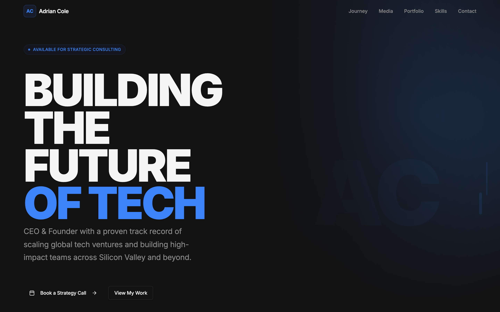
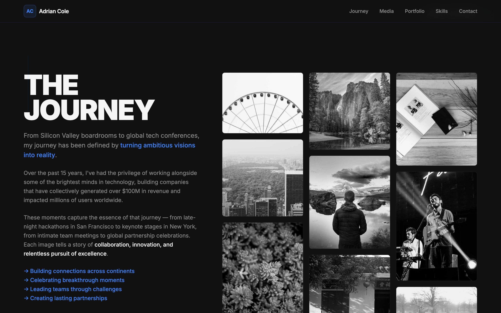
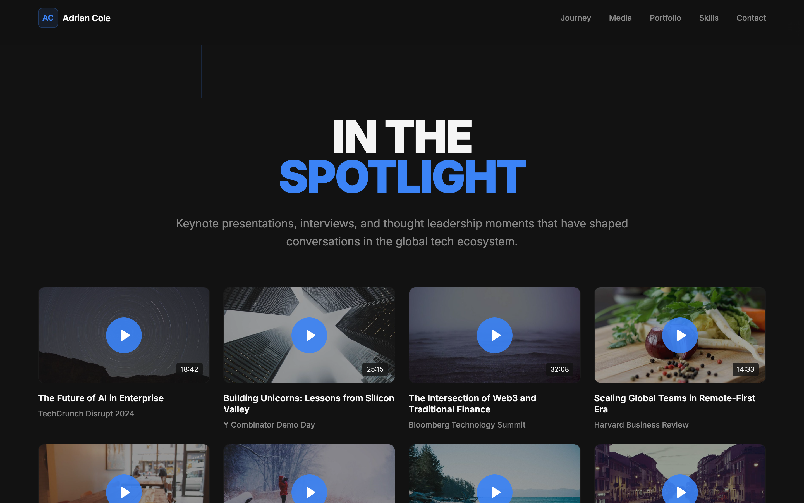
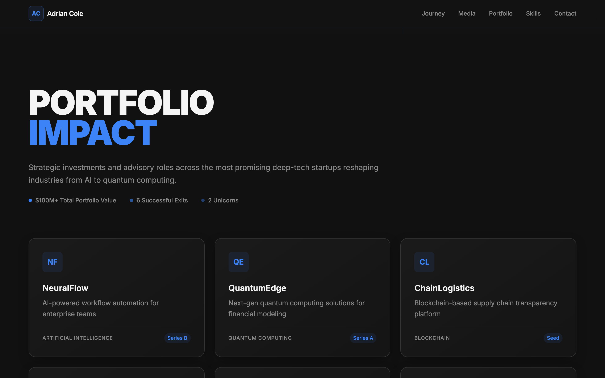
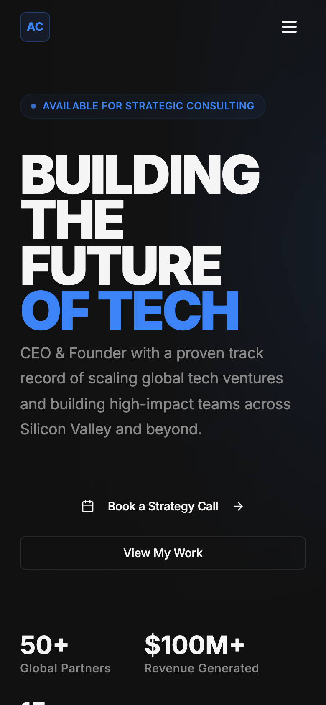

# Quiet Power Profile

> A cinematic, dark-mode personal-brand landing page for founders, CEOs, and anyone whose résumé deserves better than a PDF. Big type, electric-blue accents, and a quiet confidence that lets the work do the talking.



Think of it as your one-page power move: a stacked mega-headline, a photo-wall of your journey, a shelf of keynote appearances, a portfolio grid, and a competencies section — all wired together with smooth-scrolling navigation. Every word on the page comes from a single config file, so making it *yours* takes minutes, not surgery.

---

## Why it's cool

- **One config to rule them all** — your name, headline, stats, contact, and social links live in [`src/config/profile.ts`](src/config/profile.ts). Edit one file, rebrand the whole site.
- **Cinematic dark design system** — hand-tuned HSL tokens, an electric-blue accent, glow shadows, and an Inter-based type scale that goes from *whisper* to **MEGA-HEADLINE**.
- **Sticky smart nav** — a glassy top bar that fades in on scroll, with smooth-scroll section links and a proper mobile hamburger drawer.
- **It actually does things** — the hero buttons scroll you to the right places, the "Schedule a Call" CTAs open a pre-filled email, and the gallery/media modals really open.
- **Mobile-first, thumb-friendly** — every section reflows cleanly from a 390px phone to an ultrawide monitor.
- **No stock stranger** — the hero uses a generated monogram-and-gradient portrait, so there's no random person's face baked in. Drop in your own image whenever you like.

## Sections

| Section | What it shows |
| --- | --- |
| **Hero** | Availability badge, stacked headline, subtitle, CTAs, and headline stats |
| **Journey** | A masonry photo wall with a full-screen lightbox and prev/next nav |
| **Media** | Keynote & interview grid with a click-to-open video modal |
| **Portfolio** | Investment / project cards with sector + stage tags |
| **Skills** | Six core competencies plus a stat band |
| **Contact** | Email, location, socials, and a "Schedule a Call" CTA |

---

## Quick look

| Journey wall | Media & speaking |
| --- | --- |
|  |  |

| Portfolio grid | On mobile |
| --- | --- |
|  |  |

---

## Getting started (zero assumptions)

You need exactly one thing installed: **Node.js 18 or newer** (which brings `npm` along for the ride). Not sure if you have it?

```bash
node -v   # should print v18.x or higher
```

Nothing there? Grab it from [nodejs.org](https://nodejs.org/) or, if you like tidy version management, use [nvm](https://github.com/nvm-sh/nvm):

```bash
nvm install --lts
nvm use --lts
```

### Run it locally

```bash
# 1. Clone the repo
git clone https://github.com/waleedsworld/quiet-power-profile.git
cd quiet-power-profile

# 2. Install dependencies
npm install

# 3. Fire up the dev server (hot reload included)
npm run dev
```

Vite will hand you a local URL (usually **http://localhost:8080**). Open it and you're live.

### Build for production

```bash
npm run build     # outputs a static bundle to dist/
npm run preview   # serve that bundle locally to sanity-check it
```

The `dist/` folder is plain static files — drop it on Cloudflare Pages, Netlify, Vercel, GitHub Pages, or any bucket that serves HTML.

---

## Make it yours

Open [`src/config/profile.ts`](src/config/profile.ts) and change the strings:

```ts
export const profile = {
  name: "Adrian Cole",
  role: "CEO & Founder",
  initials: "AC",
  headline: ["BUILDING", "THE FUTURE", "OF TECH"],
  subtitle: "CEO & Founder with a proven track record of...",
  email: "hello@adriancole.dev",
  location: "San Francisco, CA · Remote Worldwide",
  social: {
    linkedin: "https://linkedin.com/in/you",
    twitter: "https://twitter.com/you",
    github: "https://github.com/you",
  },
};
```

Set any social link to `""` to hide it. Want to swap the portfolio companies, media clips, or competencies? Those live in their respective components under `src/components/` — each is a small, readable array at the top of the file.

> **Heads up:** the default content is a demo persona ("Adrian Cole") so you can see the template in action. Replace it with your own before you ship.

---

## Tech stack

- **[Vite](https://vitejs.dev/)** — lightning dev server + build
- **[React 18](https://react.dev/)** + **TypeScript** — typed, component-driven UI
- **[Tailwind CSS](https://tailwindcss.com/)** — utility styling on a custom design-token layer
- **[shadcn/ui](https://ui.shadcn.com/)** + **[Radix](https://www.radix-ui.com/)** — accessible primitives
- **[lucide-react](https://lucide.dev/)** — crisp icons

## Project structure

```
src/
├─ config/profile.ts      # ← your single source of truth
├─ components/
│  ├─ Navbar.tsx          # sticky nav + mobile drawer
│  ├─ HeroSection.tsx
│  ├─ JourneySection.tsx  # photo wall + lightbox
│  ├─ MediaSection.tsx    # keynote grid + modal
│  ├─ PortfolioSection.tsx
│  ├─ CompetenciesSection.tsx
│  ├─ Footer.tsx          # contact + socials
│  └─ ui/                 # shadcn primitives
├─ pages/Index.tsx        # section composition
└─ index.css              # design tokens + component classes
```

## Live demo

Live demo — deploying soon.

## License

MIT — do what you like, just don't blame me if you become internet-famous.
