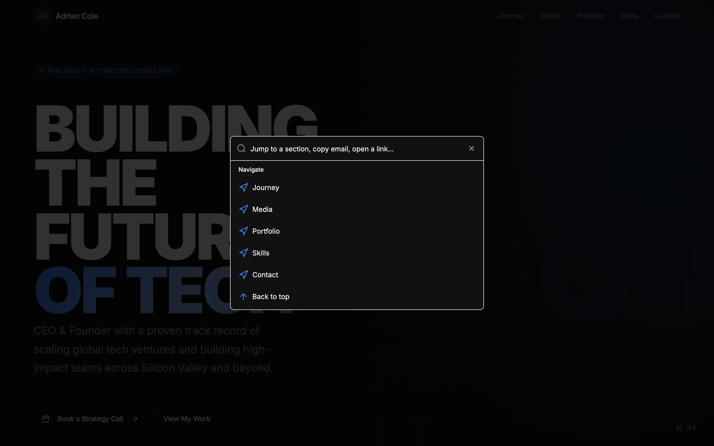
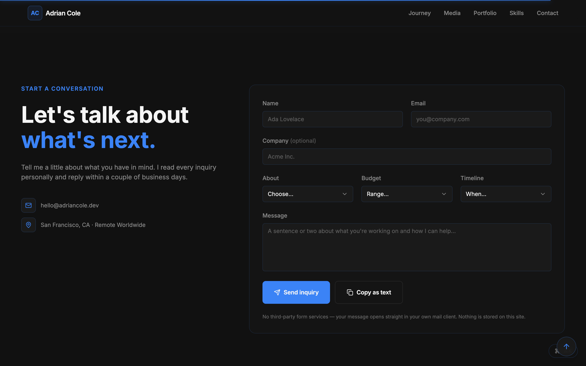
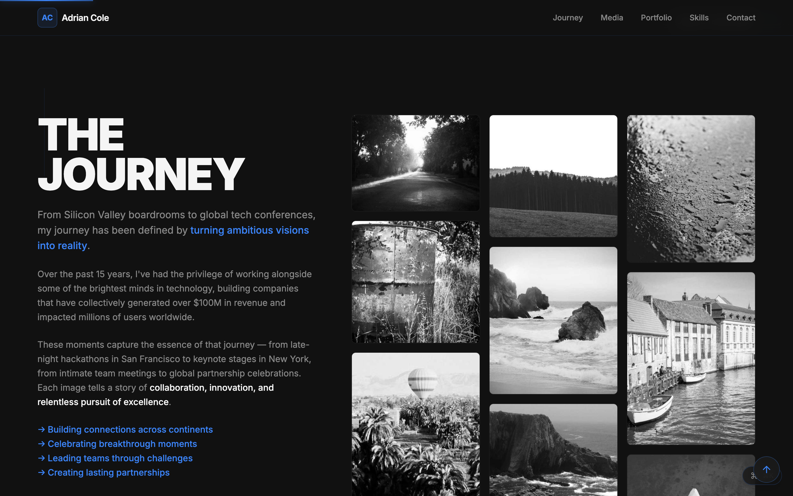
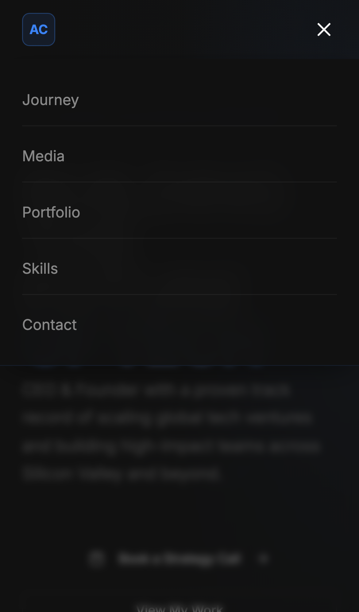
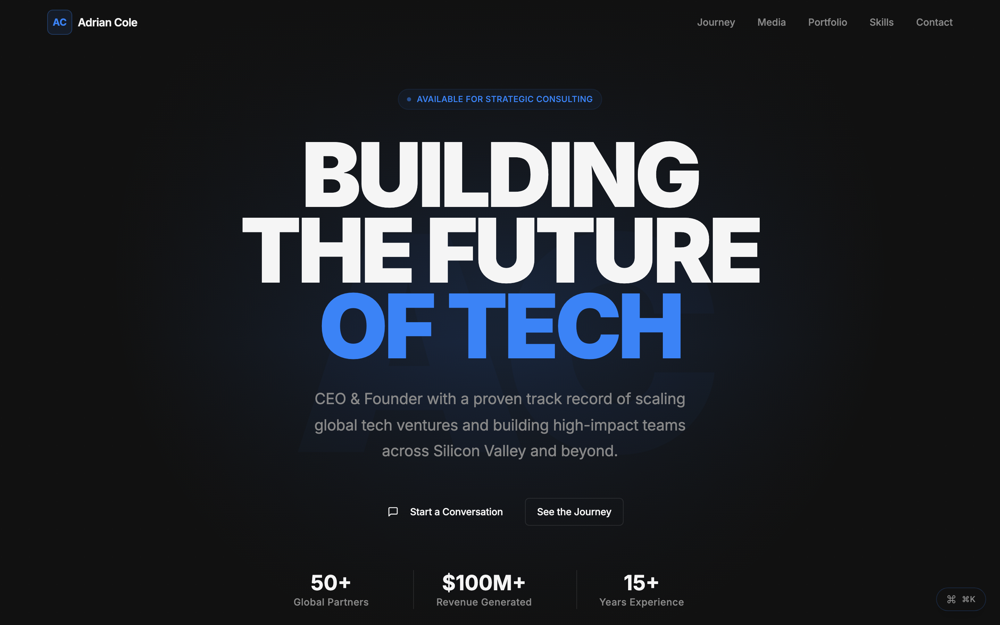

# Quiet Power Profile

[](https://basil.ceo)
[](LICENSE)
[](https://vitejs.dev/)
[](https://react.dev/)
[](https://www.typescriptlang.org/)
[](https://tailwindcss.com/)
[](https://vitest.dev/)
[](https://github.com/waleedsworld/quiet-power-profile/pulls)

> A cinematic, dark-mode personal-brand landing page for founders, CEOs, and anyone whose résumé deserves better than a PDF. Big type, electric-blue accents, and a quiet confidence that lets the work do the talking.

<p align="center">
  
</p>

**Try it in 30 seconds:**

```bash
git clone https://github.com/waleedsworld/quiet-power-profile.git && cd quiet-power-profile && npm install && npm run dev
```

Think of it as your one-page power move: a stacked mega-headline, a photo-wall of your journey, a shelf of keynote appearances, a portfolio grid, a competencies section, and a proper contact form — all wired together with smooth-scrolling navigation and a keyboard command palette. Every word on the page comes from a single config file, so making it *yours* takes minutes, not surgery.

---

## ✨ What's new

This release turned a pretty landing page into a genuinely *product-grade* one. Highlights:

- **⌘K command palette** — hit `⌘K` / `Ctrl+K` anywhere to jump to a section, copy the email, or open a social link. Power users never touch the mouse. ([`CommandPalette.tsx`](src/components/CommandPalette.tsx))
- **Real contact form** — a structured inquiry form with typed fields, validation, and a graceful "here's your pre-filled email" fallback — no backend required. ([`ContactSection.tsx`](src/components/ContactSection.tsx))
- **Motion that means it** — scroll-reveal entrances, a top scroll-progress bar, a back-to-top button, shimmer skeletons while images load, and tasteful hover micro-interactions. All of it folds flat under `prefers-reduced-motion`.
- **Accessible by construction** — skip-to-content link, visible focus rings, focus-trapped modals with focus restore, ARIA-labelled controls, and full keyboard support (Esc to close, ←/→ to page the lightbox).
- **Hardened for the real world** — body-scroll lock with scrollbar-width compensation, no accidental horizontal scroll on phones, comfortable 44px tap targets, and a drawer that closes itself when you rotate to desktop.
- **Faster to load** — vendor code-splitting (React / TanStack Query in their own cache-stable chunks) so repeat visits fly.
- **Ships to be found** — full SEO + OpenGraph/Twitter meta, a branded OG image, a favicon set, a PWA manifest, `robots.txt`, and a `sitemap.xml`.
- **A/B hero variants** — two hero framings behind a `?variant=` query string, with zero content duplication. ([jump ↓](#ab-landing-variants))
- **A real test suite** — Vitest unit/component tests, a Playwright end-to-end smoke, and a GitHub Actions CI that runs lint → test → build on every push.

---

## Why it's cool

- **One config to rule them all** — your name, headline, stats, contact, and social links live in [`src/config/profile.ts`](src/config/profile.ts). Edit one file, rebrand the whole site.
- **Cinematic dark design system** — hand-tuned HSL tokens, an electric-blue accent, glow shadows, and an Inter-based type scale that goes from *whisper* to **MEGA-HEADLINE**.
- **Sticky smart nav** — a glassy top bar that fades in on scroll, with smooth-scroll section links and a proper mobile hamburger drawer.
- **It actually does things** — the hero buttons scroll you to the right places, the CTAs open a pre-filled email, and the gallery/media modals really open (and trap focus, and close on Esc).
- **Mobile-first, thumb-friendly** — every section reflows cleanly from a 390px phone to an ultrawide monitor.
- **No stock stranger** — the hero uses a generated monogram-and-gradient portrait, so there's no random person's face baked in. Drop in your own image whenever you like.

## Sections

| Section | What it shows |
| --- | --- |
| **Hero** | Availability badge, stacked headline, subtitle, CTAs, and headline stats |
| **Journey** | A masonry photo wall with a focus-trapped lightbox and ←/→ nav |
| **Media** | Keynote & interview grid with a click-to-open video modal |
| **Portfolio** | Investment / project cards with sector + stage tags |
| **Skills** | Six core competencies plus a stat band |
| **Contact** | Structured inquiry form, email, location, and socials |

---

## Quick look

| Command palette (`⌘K`) | Contact form |
| --- | --- |
|  |  |

| Journey wall | On mobile |
| --- | --- |
|  |  |

---

## Getting started (zero assumptions)

You need exactly one thing installed: **Node.js 18 or newer** (which brings `npm` along for the ride). Not sure if you have it?

```bash
node -v   # should print v18.x or higher
```

Nothing there? Grab it from [nodejs.org](https://nodejs.org/) or, if you like tidy version management, use [nvm](https://github.com/nvm-sh/nvm):

```bash
nvm install --lts
nvm use --lts
```

### Run it locally

```bash
# 1. Clone the repo
git clone https://github.com/waleedsworld/quiet-power-profile.git
cd quiet-power-profile

# 2. Install dependencies
npm install

# 3. Fire up the dev server (hot reload included)
npm run dev
```

Vite will hand you a local URL (usually **http://localhost:8080**). Open it and you're live.

### Build for production

```bash
npm run build     # outputs a static bundle to dist/
npm run preview   # serve that bundle locally to sanity-check it
```

The `dist/` folder is plain static files — drop it on Cloudflare Pages, Netlify, Vercel, GitHub Pages, or any bucket that serves HTML. A `public/_redirects` rule keeps client-side routes working on Pages-style hosts.

### Test it

```bash
npm test          # Vitest unit + component suite
npm run test:e2e  # Playwright end-to-end smoke (needs a browser: npx playwright install)
npm run lint      # ESLint
```

---

## Make it yours

Open [`src/config/profile.ts`](src/config/profile.ts) and change the strings:

```ts
export const profile = {
  name: "Adrian Cole",
  role: "CEO & Founder",
  initials: "AC",
  headline: ["BUILDING", "THE FUTURE", "OF TECH"],
  subtitle: "CEO & Founder with a proven track record of...",
  email: "hello@adriancole.dev",
  location: "San Francisco, CA · Remote Worldwide",
  social: {
    linkedin: "https://linkedin.com/in/you",
    twitter: "https://twitter.com/you",
    github: "https://github.com/you",
  },
};
```

Set any social link to `""` to hide it. Want to swap the portfolio companies, media clips, or competencies? Those live in their respective components under `src/components/` — each is a small, readable array at the top of the file.

> **Heads up:** the default content is a demo persona ("Adrian Cole") so you can see the template in action. Replace it with your own before you ship.

---

## <a id="ab-landing-variants"></a>A/B landing variants

The hero ships in two flavours so you can test which framing converts better —
no feature-flag service, just a query string:

| URL | Variant | Look |
| --- | --- | --- |
| `/` | **A** (default) | Cinematic split layout: left-aligned stacked headline, portrait monogram panel on the right, primary CTA **"Book a Strategy Call"**. |
| `/?variant=b` | **B** | Centered editorial layout: single flowing headline over one focal glow, inline divider-separated stats, conversational CTA **"Start a Conversation"**. |

<p align="center">
  
</p>

Both arms read from the same `config/profile.ts`, so there's no content to keep
in sync — only the frame around it changes. Share `?variant=b` to send traffic
to the B arm; anything else lands on A. The wiring:

```
src/lib/variant.ts             # reads ?variant= from the URL (defaults to "a")
src/components/HeroVariant.tsx  # picks A or B
src/components/HeroSection.tsx  # variant A (default)
src/components/HeroSectionB.tsx # variant B (centered editorial)
```

To make B the default, swap the ternary in `HeroVariant.tsx`; to add a variant C,
extend the `Variant` type in `variant.ts` and add a branch.

---

## Tech stack

- **[Vite](https://vitejs.dev/)** — lightning dev server + build (with vendor chunk splitting)
- **[React 18](https://react.dev/)** + **TypeScript** — typed, component-driven UI
- **[Tailwind CSS](https://tailwindcss.com/)** — utility styling on a custom design-token layer
- **[shadcn/ui](https://ui.shadcn.com/)** + **[Radix](https://www.radix-ui.com/)** — accessible primitives
- **[cmdk](https://cmdk.paco.me/)** — the ⌘K command palette
- **[lucide-react](https://lucide.dev/)** — crisp icons
- **[Vitest](https://vitest.dev/)** + **[Testing Library](https://testing-library.com/)** + **[Playwright](https://playwright.dev/)** — unit, component, and e2e tests

## Project structure

```
src/
├─ config/profile.ts       # ← your single source of truth
├─ components/
│  ├─ Navbar.tsx           # sticky nav + mobile drawer
│  ├─ HeroSection.tsx      # variant A hero
│  ├─ HeroSectionB.tsx     # variant B hero
│  ├─ HeroVariant.tsx      # ?variant= switch
│  ├─ JourneySection.tsx   # photo wall + focus-trapped lightbox
│  ├─ MediaSection.tsx     # keynote grid + video modal
│  ├─ PortfolioSection.tsx
│  ├─ CompetenciesSection.tsx
│  ├─ ContactSection.tsx   # structured inquiry form
│  ├─ CommandPalette.tsx   # ⌘K quick actions
│  ├─ ScrollProgress.tsx   # top progress bar
│  ├─ BackToTop.tsx
│  ├─ Reveal.tsx           # scroll-reveal wrapper
│  ├─ ImageWithSkeleton.tsx
│  ├─ Footer.tsx
│  └─ ui/                  # shadcn primitives
├─ hooks/
│  └─ use-overlay.ts       # scroll-lock + focus-trap + arrow-nav for modals
├─ lib/
│  ├─ a11y.ts              # reduced-motion aware smooth scroll
│  └─ variant.ts           # A/B variant resolver
├─ pages/Index.tsx         # section composition
└─ index.css               # design tokens + component classes
```

## Live demo

**[basil.ceo](https://basil.ceo)** — the template running in production.

## License

MIT — do what you like, just don't blame me if you become internet-famous.
